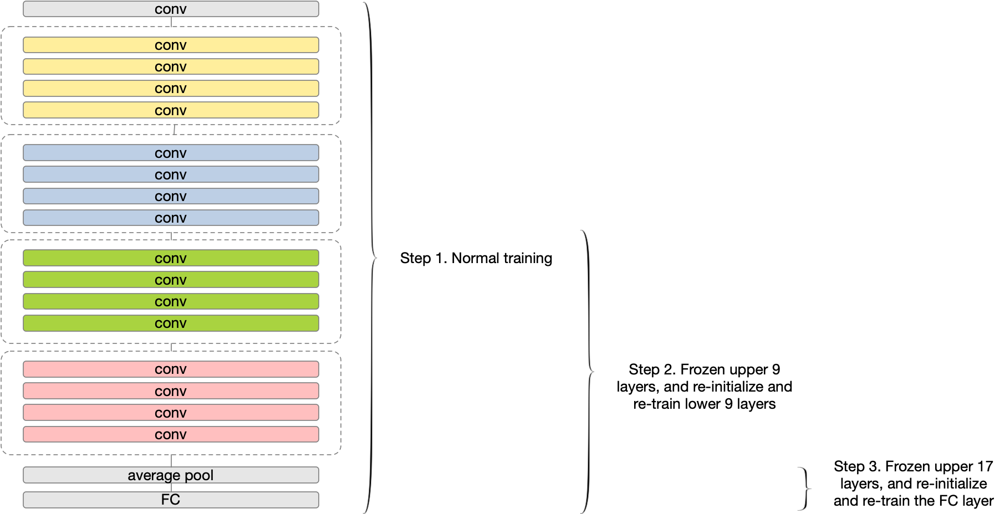

<div align="center">   
  
# Understanding and Improving Early Stopping for Learning with Noisy Labels
[](https://arxiv.org/abs/2106.15853)

</div>

Official implementation of [Understanding and Improving Early Stopping for Learning with Noisy Labels](https://arxiv.org/abs/2106.15853) (NeurIPS 2021).

The memorization effect of deep neural network (DNN) plays a pivotal role in many state-of-the-art label-noise learning methods. To exploit this property, the early stopping trick, which stops the optimization at the early stage of training, is usually adopted. Current methods generally decide the early stopping point by considering a DNN as a whole. However, a DNN can be considered as a composition of a series of layers, and we find that the latter layers in a DNN are much more sensitive to label noise, while their former counterparts are quite robust. Therefore, selecting a stopping point for the whole network may make different DNN layers antagonistically affected each other, thus degrading the final performance. In this paper, we propose to separate a DNN into different parts and progressively train them to address this problem. Instead of the early stopping, which trains a whole DNN all at once, we initially train former DNN layers by optimizing the DNN with a relatively large number of epochs. During training, we progressively train the latter DNN layers by using a smaller number of epochs with the preceding layers fixed to counteract the impact of noisy labels. We term the proposed method as progressive early stopping (PES). Despite its simplicity, compared with the early stopping, PES can help to obtain more promising and stable results. Furthermore, by combining PES with existing approaches on noisy label training, we achieve state-of-the-art performance on image classification benchmarks.


<p float="left" align="center">
 
<figcaption align="center">
The illustration of PES in the training process. Progressively train each part of the network with original noisy labels. The training process of PES when the number of parts is 3.
</figcaption>
</p>


## Requirements
- This codebase is written for `python3` and 'pytorch'.
- To install necessary python packages, run `pip install -r requirements.txt`.


## Experiments
### Data
- Please download and place all datasets into the data directory. 


### Training

To train PES without semi on CIFAR-10/100

```
python PES_cs.py --dataset cifar10 --noise_type symmetric --noise_rate 0.5
```

```
python PES_cs.py --dataset cifar100 --noise_type instance --noise_rate 0.4
```

To train PES with semi on CIFAR-10/100

```
python PES_semi.py --dataset cifar10 --noise_type instance --noise_rate 0.4  --lambda_u 15
```

```
python PES_semi.py --dataset cifar100 --noise_type pairflip --noise_rate 0.45  --lambda_u 50
```

To train PES on Clothing1M

```train Clothing1M
python PES_Clothing1M.py
```

We also evaluate our method on [CIFAR-N Dataset](http://www.noisylabels.com/)

```
python PES_noisylabels.py --noise_type aggre_label   --dataset CIFAR10 --seed 1
```

```
python PES_noisylabels.py --noise_type random_label1 --dataset CIFAR10 --seed 1
```

```
python PES_noisylabels.py --noise_type random_label2 --dataset CIFAR10 --seed 1
```

```
python PES_noisylabels.py --noise_type random_label3 --dataset CIFAR10 --seed 1
```

```
python PES_noisylabels.py --noise_type worse_label   --dataset CIFAR10 --seed 1
```

```
python PES_noisylabels.py --dataset CIFAR100 --seed 1
```

## License and Contributing
- This README is formatted based on [paperswithcode](https://github.com/paperswithcode/releasing-research-code).
- Feel free to post issues via Github. 


## Reference
If you find the code useful in your research, please consider citing our paper:

<pre>
@inproceedings{
    bai2021pes,
    title={Understanding and Improving Early Stopping for Learning with Noisy Labels},
    author={Yingbin Bai and Erkun Yang and Bo Han and Yanhua Yang and Jiatong Li and Yinian Mao and Gang Niu and Tongliang Liu},
    booktitle={NeurIPS},
    year={2021},
}
</pre>
